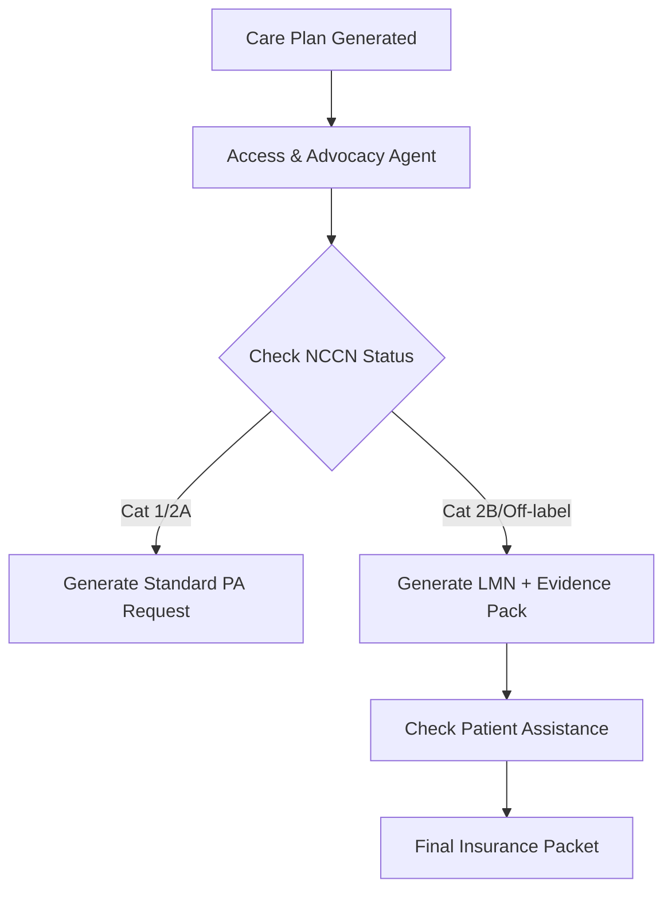

# 🛡️ Module 15: Access & Advocacy Agent - Deep Dive & Implementation Plan

**Focus**: Financial Toxicity, Prior Authorization (PA) Automation, and Patient Advocacy against Insurance Denials.

---

## 🛑 The Pain: "Death by 1000 Faxes"

### 1. The Clock vs. The Cancer
- **The Reality**: Cancer doesn't wait for "5-7 business days".
- **The Pain**: 96% of radiation oncologists report treatment delays due to PA.
- **Impact**: Disease progression during the 2-4 week wait for approval. Patients feel "abandoned" by the system while doctors fight paperwork.

### 2. The "Step Therapy" Trap
- **The Reality**: Insurers often require patients to "fail" cheaper drugs before approving the effective one (Fail-First).
- **The Pain**: A patient with *BRCA1* mutation is forced to take standard chemo instead of a PARP inhibitor because they haven't "failed" chemo yet.
- **Impact**: Unnecessary toxicity, lost time, and psychological trauma of taking ineffective medication.

### 3. The Evidence Gap
- **The Reality**: Denials often happen because the insurer "didn't see" the specific evidence.
- **The Pain**: The doctor knows *why* (e.g., "This *KRAS* G12C requires Sotorasib"), but the clerk at the insurance company just sees "Lung Cancer Drug for non-Lung Cancer patient" (Off-label).
- **Impact**: Automatic denial. The doctor must then spend hours writing a "Letter of Medical Necessity" (LMN) citing papers the insurer could have looked up.

### 4. Financial Toxicity
- **The Reality**: Even if approved, copays can be $3,000/month.
- **The Pain**: "GoFundMe" is not a healthcare plan. Patients skip doses to save money.
- **Impact**: Suboptimal adherence, worse outcomes, bankruptcy.

---

## 🛡️ The Solution: Module 15 (Access & Advocacy Agent)

We will build an agent that fights back with **weaponized documentation**. It doesn't just "ask" for permission; it builds an unassailable legal and clinical case for *why* this treatment is necessary, right now.

### Core Capabilities

#### 1. 🤖 Pre-Emptive LMN Generator (Letter of Medical Necessity)
- **What it does**: Automatically drafts a forceful, citation-heavy letter signed by the oncologist.
- **How**:
  - Pulls diagnosis & mutations from **Module 01 & 02**.
  - Pulls drug efficacy evidence from **Module 04**.
  - Pulls NCCN Guidelines status (Category 1/2A).
  - **Enhancement**: Uses "Insurance-Speak" templates (e.g., "Standard of Care," "Life-threatening condition," "No alternative therapies").

#### 2. 📑 "The Brick" (Automated Packet Assembly)
- **What it does**: Compiles the *exact* PDF packet insurers require, so they can't claim "missing information".
- **Includes**:
  - Current Clinical Note (with "Plan" highlighted).
  - Pathology Report.
  - NGS/Biomarker Report (highlighting the target).
  - 2-3 Key PubMed Abstracts (from Module 04) proving efficacy.
  - NCCN Compendium listing.

#### 3. 🔮 Denial Prediction & Avoidance
- **What it does**: Predicts *why* they might say no.
- **Example**: "Warning: You are prescribing Olaparib for a patient with *ATM* mutation (not *BRCA*). This is NCCN Category 2B. High risk of denial. **Suggestion**: Attach the 'PROfound' trial paper to the packet."

#### 4. 💸 Financial Defense
- **What it does**: Checks eligibility for Co-pay Cards and Patient Assistance Programs (PAPs).
- **Example**: "Patient prescribed Keytruda. Automatic check: Merck Access Program eligibility? YES. Link generated."

---

## 🛠️ Technical Architecture

### Integration Point
Fits after **Module 07 (Care Plan)** and before **Module 08 (Monitoring)**.

### Data Sources
1.  **NCCN API / Guidelines DB**: To verify "On-label" vs "Off-label".
2.  **Patient Profile (Module 01/02)**: For ICD-10 codes, mutation status.
3.  **Drug DB (Module 04)**: For FDA indication status.

### Outputs
1.  `letter_of_medical_necessity.pdf`
2.  `prior_auth_form_filled.json`
3.  `appeal_letter_template.txt` (if denied)

---

## 🚀 Implementation Roadmap

1.  **Phase 1: The Writer (LMN Generation)**
    -   Template engine for LMNs.
    -   Integration with Module 04 to pull citations.

2.  **Phase 2: The Checker (NCCN/FDA Validation)**
    -   Logic to check "Drug + Disease + Biomarker" against FDA label.
    -   "Off-label" warning system.

3.  **Phase 3: The Assembler (Packet Generation)**
    -   PDF compilation of reports.

4.  **Phase 4: The Advocate (Appeal Logic)**
    -   "They denied for 'Not Medically Necessary'? Here is the Appeal Letter citing the specific error in their judgment."

---

## 📝 Example Output (LMN Snippet)

> "To Whom It May Concern at [Payer Name],
>
> I am writing to provide urgent medical necessity for the use of **[Drug Name]** for my patient, **[Patient Name]** (DOB: [Date], ID: [ID]).
>
> The patient has a diagnosis of **[Disease]** (ICD-10: [Code]). Comprehensive genomic profiling (attached) has identified a pathogenic **[Mutation]** variant.
>
> **Clinical Justification:**
> The NCCN Guidelines (Version [X]) list this agent as a Category [Y] recommendation for this alteration. Furthermore, the [Trial Name] study (Citation: [Source]) demonstrated a [Z]% improvement in Progression-Free Survival for patients with this specific biomarker profile.
>
> Denial of this evidence-based therapy would be inconsistent with current standards of oncological care and would cause irreversible harm to the patient...

